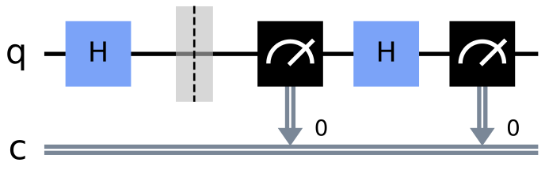

# ITS-Quantencryptographie

This Repository consits of only the Paper I´ve written as my Exam Project.

Special Thanks to Robin Seeger for correcting my Mistakes!

# Quanten Cryptographie
## Table of Contents
- [ITS-Quantencryptographie](#its-quantencryptographie)
- [Quanten Cryptographie](#quanten-cryptographie)
  - [Table of Contents](#table-of-contents)
  - [Introduction ](#introduction-)
  - [Methods ](#methods-)
    - [Symmetrical-Encryption ](#symmetrical-encryption-)
    - [Asymetrical Encryption ](#asymetrical-encryption-)
  - [Quanten Methods ](#quanten-methods-)
    - [Quantum-Parallelism ](#quantum-parallelism-)
    - [Shors-Algorithm ](#shors-algorithm-)
    - [Qubits ](#qubits-)
    - [Grovers-Algorithm ](#grovers-algorithm-)
  - [Use Cases ](#use-cases-)
    - [Decryption ](#decryption-)
    - [Encryption ](#encryption-)
    - [Encryption Example ](#encryption-example-)
  - [Conclusion](#conclusion)
  - [Citations](#citations)

## Introduction <a name="introduction"></a>
When it is important to communicate securely over the internet, one must ensure an encrypted method to transfer Data. This is done by encrypting the Data via various, usually mathematical based, techniques. Now with the wider access to Quantum Computers (QC) these conventional techniques can be decrpyted with new algorithms, additionally new quanten algorithms allow unbreakable encrpytion for data transfer.

Traditional encryption methods as well as some type of quantum encryption methods are based on sharing two keys.

The widely used encryption techniques today are usually based on one hand, the symmetrical techniques with the “Advanced Encryption Standart” (AES) or the “Data Encryption Standard” (DES) and on the other hand the
assymetrical techniques like the “RSA”-Procedure. Altough there is an
ongoing struggle between encrypters and decrypters, the above listed
techniques are still usable in real world scenarios. Although the
symmetrical techniques have been cracked in theoretical cases.[4]

Now with the wider access to Quantum Computers a third technique enters
the cryptographie landscape, Quantum cryptographie. Quantum
Cryptograpghy meaning the ent- and decrpytion of data.

## Methods <a name="Methods"></a>

### Symmetrical-Encryption <a name="subparagraph2.1"></a>
The Vernam-Code is technically an absolut secure encryption algorithm,
but in reality, the randomly generated key is usually not completely
random, which means a powerful computer can identify the rules after
which the key is generated and reproduce set key.[1]

Furthermore, the way to communicate the key between sender and receiver
is usually not completely secure as well. Today any key can be
intercepted with every conventional way of communication,
i.e. wire-based and wireless. As a result, the authenticity of a
message is not garanteed, since the receiver can send messages to
himself and make it look like they originated somewhere else.[1]

### Asymetrical Encryption <a name="subparagraph2.2"></a>
The most widely used and accepted types of encryptions avoid the drawbacks of a secure key transmission and the authenticity by dedicating two different key to sender and receiver. The used technique is called *public key cryptography* because the used encryption is publicly known. This technique is secure because it is impossible for todays most advacend computers to decrypt the keys. To decrypt the encrypted key, one must derive the decrpyted key from the encrypted one.[1]

Assymetrical encrypted procedures are based on the so called “trapdoor-function”. It is easy to “enter” set function, but difficult to impossible to exit, meaning it is easy to multiply two prime numbers *p* and *q* to receive *n* (key) *n = p * q*. But it is difficult to calculate the arguments which led to the result, altough we know that a prime number is a product of a natural number we cant calculate *p* and *q* from *n*.[1]

In the field of algorithmic complexity theory to calculate *p* and *q* from *n* is a “NP-Problem with an exponential time of calculation”. There hasent been any successfull approach to reduce the complexity.[1]

To encrypt a number, it is only necessary to know product *n*, which means the sender makes *n* public and keeps the factors *p* and *q* hidden. Decrypting is only possible if one knows the prime numbers *p* and *q*.[1]

## Quanten Methods <a name="quanten-methods"></a>
### Quantum-Parallelism <a name="subparagraph3.1"></a>
Quantum-parallelism is a method to compute multiple calculations at once
by having many conditions at the same time. In a Qubit register of size
*m* a superpoition can save the amount 2^*m* of *m* possible Qubits. A
regular computer with a register of size *m* Bits can only save the
amount of 2*m*.  
With quantum-parallelism, Shor´s Algorithm is able to calculate the
prime factors. The calculation of a factorial number with a wordsize
larger than 1024 Bit is nearly impossible for a regular computer.[1]

### Shors-Algorithm <a name="subparagraph3.2"></a>
Shor´s Algorithm on a quantum computer can decrypt every RSA encrypted message. It assumes that a number *n* can be factorized, if the modulfunction *f(x)= a^x mod n* for a number *a* \< *n* can be calculated.[1]

### Qubits <a name="subparagraph3.3"></a>
A Qubit is the quantum variant of a bit, they represent the same function by storing and returning data as *1* or *0*. But they can be altered in additional ways, which allows us to use new algorithms and therefore calculate functions not possible before. Qubits can be in multiple states, represented by vectors, matrices, and complex numbers.[7][8]

### Grovers-Algorithm <a name="subparagrah3.4"></a>
Grovers-Algorithm can speed up an unstructured search problem quadratically by using Grovers amplitude amplification. Amplitude amplification amplifies the amplitude of a searched item while also decreasing the amplitudes of the other insignificant items.[9]

## Use Cases <a name="use-cases"></a>
### Decryption <a name="subparagraph4.1"></a>
There are ways to decrpyt even the best RSA-Procedures, the algorithm used for this problem was discovered by Peter Shor in 1994. It solves the factorial problem in polynomial time.[1] A problem is in polynomial time solvable if a deterministic calculator can solve it in a time which does not grow stronger as a polynomial function.[5]

Shors algorithm uses the "Quantum-parallelism" and can therefore decrypt factorial numbers from up to 1024 Bit´s. Which means as soon as a QC with a big enough computing power exists, Shor´s alogrithm will be able to decrpyt any fomr of RSA and the data currently encrypted this way will be at risk.[1]

Addtionally Symmetrical Encrpyted Keys based on DES / AES can be decrypted with Grovers-Algorithm. Grovers-Algorithm is based on ab brute force technique by testing every possible Key. A QC decreases the necessary time to find the right key by two. 

### Encryption <a name="subparagraph4.2"></a>
As previously described with conventional encryption, it is neccesary that the secret key won´t be stolen, for example by symmetric-key cryptographie during the transmission. If a quantum communication channel is used the participants Bob and Alice will know if a third party (Eve) intercepted the message (Bob, Alice and Eve are just placeholder protagonists).[6] Quantum communication networks are in development at multiple universities and companies, but none has left the development stage yet.[10]

The in the Example used protocol uses the fact that the measurement of a qubit changes the Qubits state. If Alice sends Bob a message and Eve is listening and therefore measures the Qubit before Bob does, the chance of a change in the state of the Qubits increases. Therefore, Bob will not receive the message i.e. the Qubits Alice sent.[6]

For example, if Alice sends a Qubit 0 in the X-basis and Bob measueres it in the X-basis, Bob measures 0. If Eve tries to measure the Qubit (first black square with arrow pointing to C) now before Bob in the Z-basis before it reaches Bob, she will change the Qubits state to either 0 or 1 and Bob will receive the initial 0 with a chance of only 5 %. Now Alice and Bob know Eve is evesdropping.[6]


To make tapping as hard as possible, the quantum key distribution protocol requires the following process enough times so an evesdropper can´t get away unnoticed. Which requires the following stepts:[6]
1. Alice generates a string of random bits, e.g.: 1000101011010100
2. Alice chooses a random basis for each bit: ZZXZXXXZXZXXXXXX
3. She keeps the two Values private.
4. Alice encodes each bit onto a string of Qubits using the basis she chose, so each Qubit is in one of the states |0⟩,|1⟩,|+⟩ or |-⟩, with the states chosen at random. The original Qubit string looks like this:|0⟩,|0⟩,|0⟩,|0⟩,|0⟩,|0⟩,|0⟩,|0⟩,|0⟩,|0⟩,|0⟩,|0⟩,|0⟩ which is the message she sends to Bob.
5. Bob measures each Qubit at a random basis (black square with an arrow pointing to C), for example at: XZZZXZXZXZXZZZXZ He keeps the result of the measurement private. 
6. Alice and Bob share the basis which they used for each Qubit private. If Bob measured a Qubit in the same basis as Alice prepared it in, the Qubit becomes part of their shared secret key, if the Qubit does not match its discarded.
7. Alice and Bob share a random sample of their keys and if the sample matches, they know (to a small error margin) that their transmission is succesfull.

A potential evesdropper (Eve), changes the above scheme after step 4 as follows:
1. Eve measures the Qubits at a random basis (just like Bob would) before they reach Bob.
2. Eves measurement changed the basis of the Qubits which she now forwards to Bob.
3. Now Bob and Alice share their basis choices (similar to step 6 above):
4. Since the keys dont match anymore, they know something failed during the transmision and they discard the Data.

Since it is possible for Eve to guess the right basis Quantum Encryption is not 100 % safe. But the rate can be measuret and is as follows: 0.75^x,  x being the length of bits used for the key.

### Encryption Example <a name="subparagraph4.3"></a>

The whole example is available as a jupyter notebook in binder here:[]()
```
- link here!!
```

## Conclusion
Since this work consists of two parts, the en- and decrpytion, it its necessary to separate the results as well.

For decryption, if there is a powerful enough QC overnight which can calculate and run the neccesary Algorithms, a whole lot of Data is at risk. Since all Data encrypted with traditional Algorithms and “regular” Computers is at risk of decryption. Therefore, a lot of private Information is publicly visable and most likely accesible, for example Bank Accounts, Messages and so forth.

Which requires Data encrpyted with RSA and Diffie-Hellman to be encprypted with a new Algorithm which is not at risk by QC. For Data encrypted with DES / AES it is neccesary to increase the length of the encryption key, or use a different Algorithm all together.

Quantum Encryption is only reasonable in certain use cases but technically superior to traditional methods. Its downside is the expensive technological requirements to run the network of which the participants need to be part of.

En- and decryption are both subject to certain limitations caused by the physical nature of Quantum Technology.
  

## Citations
[1] Mainzer, Klaus. "Quantencomputer: von der Quantenwelt zur Künstlichen Intelligenz", 2020. [Book]\
[2] Hughes, Ciaran; Isaacson, Joshua; Perry, Anastasia; Sun, Ranbel F.; Turner, Jessica. "Quantum Computing for the Quantum Curious", 2021. [Book]\
[3] Homeister, Matthias. "Quantum Computing verstehen: Grundlagen - Anwendungen - Perspektiven", 2022. [Book]\
[4] Schmeh, Klaus. "Codeknacker gegen Codemacher: die faszinierende Geschichte der Verschlüsselung", 2022. [Book]\
[5]Dwedney, A.K. "Der Turing Omnibuds", 1995. [Book]\
[6]The Jupyter Book Community, [Quantum Key Distribution](https://qiskit.org/textbook/ch-algorithms/quantum-key-distribution.html#1.-Introduction), 2021. [Online]\
[7]The Jupyter Book Community, [Representing Qubit States](https://qiskit.org/textbook/ch-states/representing-qubit-states.html), 2021. [Online]\
[8]The Jupyter Book Community, [Defining Quantum Circuits](https://qiskit.org/textbook/ch-algorithms/defining-quantum-circuits.html), 2021. [Online]\
[9]The Jupyter Book Community, [Grovers Algorithm](https://qiskit.org/textbook/ch-algorithms/grover.html), 2021. [Online]\
[10]van Loock, Peter. [Quantum communication research network launched](https://www.uni-mainz.de/presse/aktuell/14737_ENG_HTML.php), 2021. [Online]